  

<h1 align="center">Dmytro Zuiev</h1>

  

  Full-stack developer for <b>AI products</b> and <b>Chrome extensions</b>. 
  I design and ship production-ready JavaScript systems: Chrome extensions, real-time web apps, and AI-assisted workflows. 
  Most recently I built <b>AutoInsight</b> - a commercial Chrome extension + web platform for Copart/IAAI operators with instant client ↔ operator collaboration.

  I combine hands-on engineering with business ownership experience to deliver products that are reliable, clear to use, and fast to iterate.

  
  
  
  
  
  
  
  
  
  
  
  

<h2 align="center">What I build</h2>

  <b>Chrome extensions</b> • <b>Real-time web apps</b> • <b>AI-assisted workflows</b> 
  Backend-first systems with clean architecture, tests, and CI/CD.

<h2 align="center">GitHub stats</h2>

  
  

  

<i style="color:#00F9FF">“Code is how I shape ideas into impact.”</i>

  

  

