  

<h1 align="center">Dmytro Zuiev</h1>

  

  Full-stack developer for <b>AI products</b> and <b>Chrome extensions</b>. 
  I design and ship production-ready JavaScript systems: Chrome extensions, real-time web apps, and AI-assisted workflows. 
  Most recently I built <b>AutoInsight</b> — a commercial Chrome extension + web platform for Copart/IAAI operators with instant client ↔ operator collaboration.

  I combine hands-on engineering with business ownership experience (Damax Travel, 2012–2024) to deliver products that are reliable, clear to use, and fast to iterate.

  
  
  
  

  
  
  
  
  
  
  
  
  
  
  
  

<h2 align="center">What I build</h2>

  <b>Chrome extensions</b> • <b>Real-time web apps</b> • <b>AI-assisted workflows</b> 
  Backend-first systems with clean architecture, tests, and CI/CD.

<h2 align="center">Selected projects</h2>

  🚀 <b>AutoInsight</b> — Chrome extension + web platform for Copart/IAAI operators (commercial, private code) 
  <a href="https://www.autoinsight.pro">Live</a> •
  <a href="https://chromewebstore.google.com/detail/autoinsight/kcmkmnalmfciphkbmnhgdgeckifkkbbf">Chrome Web Store</a> •
  <a href="https://www.autoinsight.pro/guide">User Guide</a>

  ☕ <b>Bean Remote (API)</b> — Node/Express + PostgreSQL/PostGIS backend for geolocation-heavy searching & filtering 
  <a href="https://be-bean-remote.onrender.com">Live API</a> •
  <a href="https://github.com/zdvman/be-bean-remote">Repo</a>

  🧠 <b>Poetry Therapy</b> — AI tool for speech therapists generating customized therapeutic poems 
  <a href="https://therapoetry.dmytrozuiev.com">Live</a> •
  <a href="https://github.com/zdvman/therapoetry">Repo</a>

  🗞️ <b>NC News</b> — full-stack Reddit-style app (view/vote/comment) 
  <a href="https://nc-news-zdvman.netlify.app">Live</a> •
  <a href="https://github.com/zdvman/nc-news">FE Repo</a> •
  <a href="https://github.com/zdvman/be-nc-news">BE Repo</a>

  ❤️ <b>Anthony Nolan AI chatbot</b> — AI-powered chatbot prototype for a blood cancer charity 
  <a href="https://anthonynolan-chatbot.vercel.app">Test Version</a>

<h2 align="center">GitHub stats</h2>

<!--
These cards are generated & committed by GitHub Actions into /profile/*.svg
So they render as normal repo files (no external 401/503/rate-limits for visitors).
-->

  
  

  

  
  

<i style="color:#00F9FF">“Code is how I shape ideas into impact.”</i>

  

  

