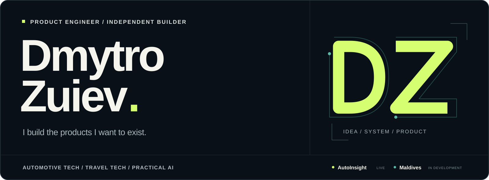
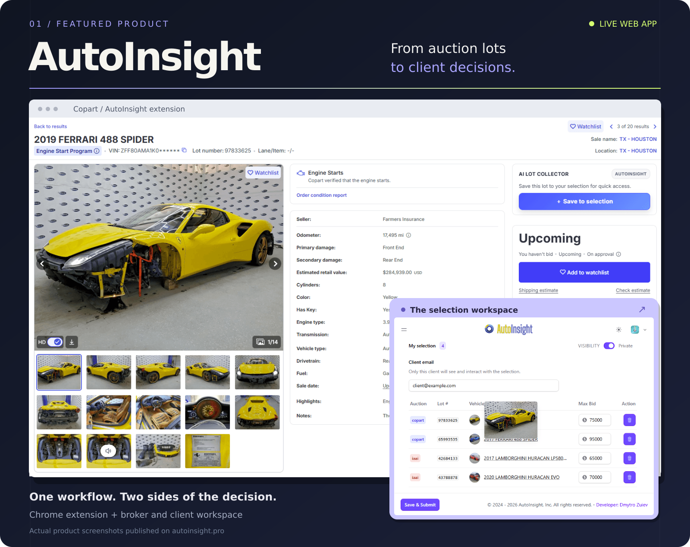
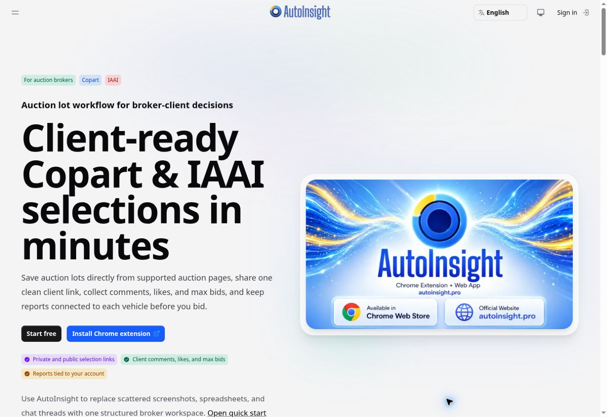
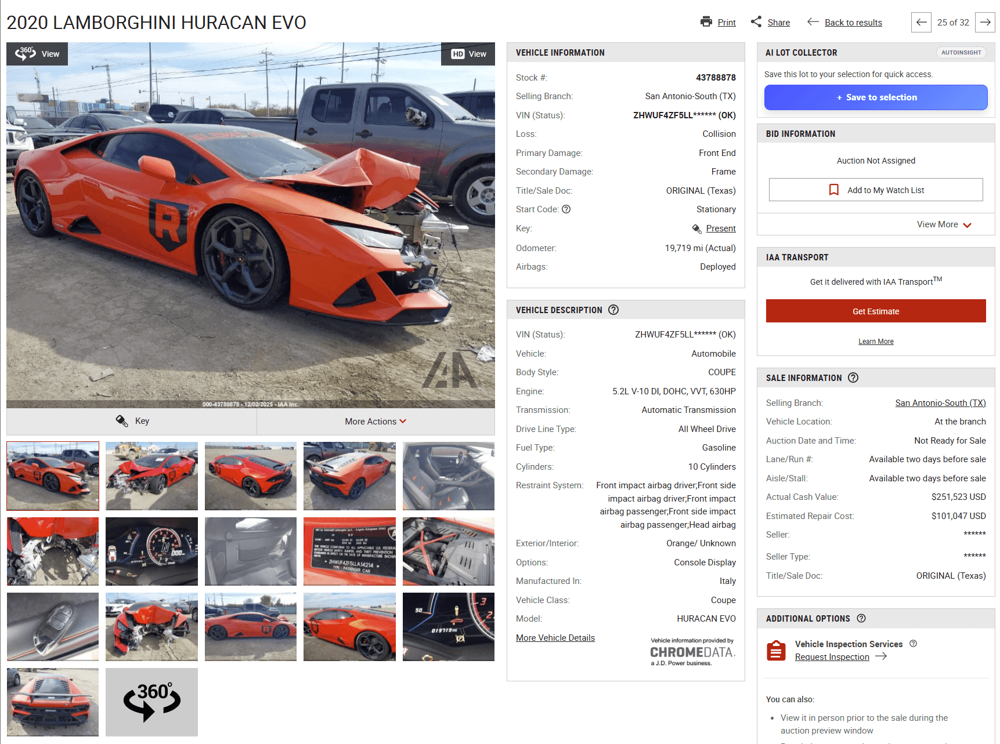
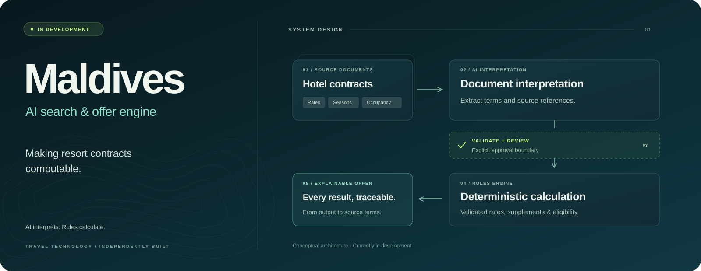

  <a href="https://www.dmytrozuiev.com"><b>PORTFOLIO ↗</b></a>
  &nbsp;&nbsp; / &nbsp;&nbsp;
  <a href="https://autoinsight.pro"><b>AUTOINSIGHT ↗</b></a>
  &nbsp;&nbsp; / &nbsp;&nbsp;
  <a href="https://www.dmytrozuiev.com/en/contact"><b>LET'S TALK ↗</b></a>

I'm an independent product builder with a background in travel and real estate. I bring business experience into hands-on engineering, from the first product decisions to architecture, integrations and delivery.

 

**AutoInsight** connects auction research with client decisions. Brokers collect Copart and IAAI lots, create selections, share a link and keep chat, likes, max bids and reports attached to each vehicle.

`Next.js` `TypeScript` `Firebase` `Chrome Extension` `Stripe`

**[Explore the live product ↗](https://autoinsight.pro)** · **[Install the extension ↗](https://chromewebstore.google.com/detail/autoinsight/kcmkmnalmfciphkbmnhgdgeckifkkbbf)**

<b>More screens from AutoInsight</b>

 

<b>The public website</b>

 

<b>The extension on an IAAI lot page</b>

 

**Maldives AI Search & Offer Engine** is my next product: turning complex resort contracts into structured rules for hotel search and offer calculation.

The architecture gives AI a specific job: interpret documents and prepare structured inputs. Validated business rules govern the planned calculation engine.

`TypeScript` `Next.js` `Node.js` `Document AI` `Rule-based pricing`

 

### Behind the products

**Business ownership → product thinking → engineering execution.**

I care about clear interfaces, explainable business rules and software that can grow without becoming difficult to maintain. My work spans web platforms, browser extensions, APIs, payments and practical AI workflows.

Outside software: cars, travel, skiing, cycling and guitars. Lately, I've been getting interested in guitar restoration and the precision behind a well-built instrument.

**Ukrainian roots. Based in Austria.**

 

  <b>Have a product worth building?</b> 
  <a href="https://www.dmytrozuiev.com/en/contact">Let's talk about it ↗</a>

